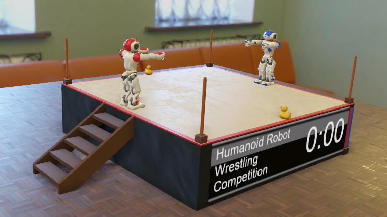

<span id="title">

# ICRA 2023 Humanoid Robot Wrestling Competition

</span>


Submition for the ICRA 2023 Humanoid Robot Wrestling Competition.



## Rules

The rules of game are implemented in the [referee supervisor](controllers/referee/referee.py).
They can be summarized as follow:

A game lasts until one of these two conditions occurs:
- **Knock-out**: If the altitude (along Z axis) of the center of mass of one robot remains below a given threshold for more than 10 seconds, then the other robot is declared the winner and the game is immediately over. This may happen if a robot falls down and cannot recover quickly or if it falls off the ring.
- **Time-out**: If no knock-out happened after 3 minutes, the robot having the greater ring *coverage* is declared the winner and the game is over. In the unlikely case of *coverage* equality, the winner is determined randomly. 

The *coverage* reflects how far a robot has moved inside the ring. It is computed over the time frame of a game from its maximum and minimum positions along the X and Y axes, respectively *X_max*, *X_min*, *Y_max* and *Y_min*, using the following formula:

```python
coverage = X_max + Y_max - X_min - Y_min
```

---

## Notes

Actuators and sensors are accessed via the ```getDevice``` method.
```python
device = Robot.getDevice("device-name")
```

### Devices

#### Actuators
All actuator device names except the head have either L or R preceeding them to indicate the left or right actuator.

- HeadPitch/Yaw
- ShoulderPitch/Roll
- ElbowYaw/Pitch
- WristYaw
- Phalanx1-8 (8 hand joints)
- HipPitch/Roll
- HipYawPitch
- KneePitch
- AnklePitch/Roll

#### Sensors
Each actuator above has a positional sensor the device is accessed by appending an ```S``` to the end of the actuator device name. Similar to the actuators; the two foot bumper sensors and Fsr sensor is preceeded with either L or R.

- accelerometer
- CameraBottom
- CameraTop
- gps
- gyro
- Sonar/Left
- Sonar/Right
- inertial unit
- Foot/Bumper/Left
- Foot/Bumper/Right
- Fsr

